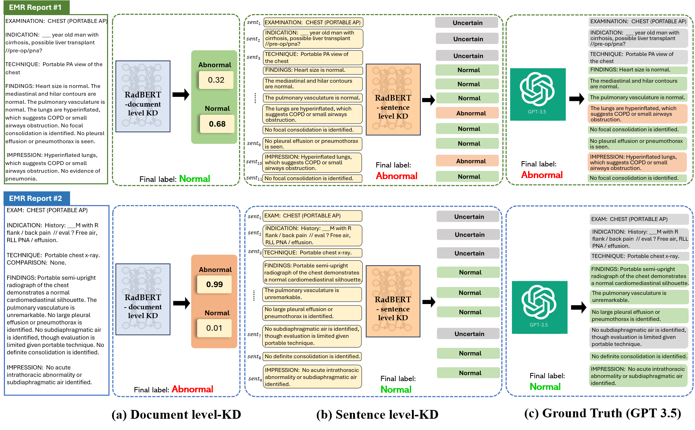

# Integrating ChatGPT into Secure Hospital Networks: A Case Study on Improving Radiology Report Analysis

Official code for **Integrating ChatGPT into Secure Hospital Networks: A Case Study on Improving Radiology Report Analysis**, accepted at the **Conference on Health, Inference, and Learning (CHIL) 2024**.



---


## 📝 Abstract

This study presents the **first in-hospital adaptation** of a cloud-based AI model, similar to ChatGPT, for analyzing radiology reports in a **secure, privacy-preserving environment**.

We introduce a novel **sentence-level knowledge distillation framework** using contrastive learning, achieving **over 95% accuracy in anomaly detection**. The model also provides **uncertainty estimates**, improving both its reliability and interpretability for physicians.

These contributions mark a significant step forward in developing secure and effective AI tools for healthcare, pointing to a promising future for **minimally supervised in-hospital AI deployment**.

---

## ⚙️ Requirements

Set up the environment using the provided `requirements.txt` file:

```bash
conda create -n normal_detection python=3.10
conda activate normal_detection
pip install -r requirements.txt
```

---

## Trained Model Checkpoints

We provide a trained **sentence-level anomaly classifier** built on the **RadBERT** backbone, achieving **0.977 AUC** in sentence-level classification under a contrastive learning setup.

👉 [Download the checkpoint (Google Drive)](https://drive.google.com/file/d/1QuRSJBnaj5Plj_XAxRE8XsyjESLyS9wb/view?usp=drive_link)

---

## Code Overview

### 🔹 GPT Labeling (`gpt_labelling/`)

- Contains code for **labeling sentences** in radiology reports via **knowledge distillation from GPT-3.5**.
- Uses zero-shot prompting and filtering to label each sentence.

### 🔹 Knowledge Distillation Ablations

We conduct ablation studies across:

1. **Backbone models** (e.g., RadBERT, BioBERT, ClinicalBERT)
2. **Input formats** (document-level vs. sentence-level)
3. **Training methods** (with/without supervised contrastive learning)

#### Folders

- `document_level_KD/`  
  Document-level knowledge distillation using RadBERT. You can modify to use other backbones.

- `sentence_level_KD/`  
  Sentence-level knowledge distillation with RadBERT. Backbone can be changed easily.

Both approaches use a **contrastive learning setup** for effective feature alignment.

---

## 📖 Citation

If you use this repository in your research, please cite:

```bibtex
@InProceedings{kim2024integrating,
  title     = {Integrating ChatGPT into Secure Hospital Networks: A Case Study on Improving Radiology Report Analysis},
  author    = {Kyungsu Kim and Junhyun Park and Saul Langarica and Adham Mahmoud Alkhadrawi and Synho Do},
  booktitle = {Conference on Health, Inference, and Learning (CHIL)},
  publisher   = {Proceedings of Machine Learning Research (PMLR)},
  volume    = {248},
  pages     = {72--87},
  year      = {2024}
}
```

